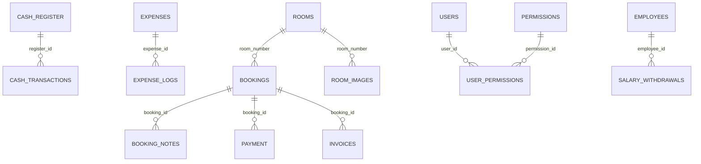

# Marina Hotel — Mobile App + Offline Sync API

This repository now includes a production-ready Android Flutter app (offline-first) with a unified REST API layer in PHP for Marina Hotel. The solution works fully offline with local SQLite and bi-directional sync to the existing MySQL database.

Contents:
- mobile/ — Flutter app (Material 3, Arabic RTL, Riverpod, Drift, Dio)
- MARINA_HOTEL_PORTABLE/api/v1/ — REST API (PHP, JWT, soft deletes, sync, uploads)
- sql/migrations/001_sync_fields.sql — Schema migration for sync fields and engine fixes
- .github/workflows/android.yml — CI to build signed APK and attach to Releases on tags v*

## 1) Database audit + ERD

Parsed from hotel_db.sql. Key entities and relationships:

Observed schema notes:
- Primary tables: rooms(room_number), bookings(booking_id), booking_notes(note_id), users(user_id), permissions(permission_id), user_permissions(id), employees(id), expenses(id), expense_logs(id), cash_register(id), cash_transactions(id), suppliers(id), invoices(id MyISAM), payment(payment_id MyISAM), salary_withdrawals(id MyISAM)
- Inconsistencies vs old api/sync.php draft:
  - No guests table; bookings store guest_* fields inline
  - bookings, rooms originally lack updated_at and deleted_at used for sync
  - Some tables are MyISAM (payment, invoices, salary_withdrawals) → no FKs/transactions

### Migration
The migration adds updated_at and deleted_at to synced tables, converts MyISAM to InnoDB, and adds safe FKs.

- File: sql/migrations/001_sync_fields.sql
- Changes:
  - ALTER TABLE add updated_at TIMESTAMP DEFAULT CURRENT_TIMESTAMP ON UPDATE CURRENT_TIMESTAMP and deleted_at TIMESTAMP NULL to:
    bookings, rooms, booking_notes, employees, expenses, cash_transactions, suppliers, users(deleted_at only), payment, invoices, salary_withdrawals
  - Convert MyISAM → InnoDB: payment, invoices, salary_withdrawals
  - Add FKs where feasible:
    - payment.booking_id → bookings.booking_id (ON DELETE SET NULL)
    - invoices.booking_id → bookings.booking_id (ON DELETE SET NULL)
    - salary_withdrawals.employee_id → employees.id (ON DELETE SET NULL)
  - Optional: room_images(id, room_number, url, created_at, updated_at, deleted_at)

Rationale: updated_at/deleted_at enable “since” sync filters and tombstones; InnoDB enables FKs and transactional consistency.

## 2) REST API (PHP) — v1

Base path: MARINA_HOTEL_PORTABLE/api/v1/

Security:
- JWT (HS256). Secret read from env JWT_SECRET (fallback "change-me").
- Authorization: Bearer <token> header
- Prepared statements everywhere; consistent JSON
- CORS enabled

Auth:
- POST auth/login.php → { success, data:{ token, user, permissions }, meta }
- POST auth/refresh.php → { success, data:{ token, permissions } }

Entities (CRUD + pagination + filter + since):
- rooms.php (PK: room_number)
- bookings.php (double-booking server-side check)
- booking_notes.php
- employees.php
- expenses.php
- cash_transactions.php
- suppliers.php
- users.php (excludes password fields on select)

Methods:
- GET /v1/<entity>.php?page&pagesize&filter&since
- GET /v1/<entity>.php/<id>
- POST /v1/<entity>.php (JSON)
- PUT /v1/<entity>.php/<id> (JSON)
- DELETE /v1/<entity>.php/<id> → soft delete (sets deleted_at)

Unified response shape:
- { success:boolean, data:any, meta?: { page, page_size, total, server_time, since } }

Uploads:
- POST uploads/rooms.php (multipart: image, room_number) → { url, meta }
  - Validates type/size (jpg/png, ≤2MB); stores under uploads/rooms/YYYY/MM/
  - Persists to room_images if present

Sync endpoints:
- POST sync/push.php → body { changes: [{ entity, op:create|update|delete, uuid, server_id?, data, client_ts }] } → per-change results with uuid mapping and conflicts
- GET sync/pull.php?since=UNIX_TS → { data:[{ entity, op, server_id, uuid, data, server_ts }], server_time }

Notes:
- DELETE is soft-delete (tombstones included in pull)
- Conflict policy: Last-write-wins by server_ts vs client_ts; bookings prevent double-booking (409) for overlapping in same room

## 3) Flutter Android app (mobile/)

Stack:
- Flutter 3.22+, Material 3, Arabic RTL default
- Riverpod (state), Drift (SQLite), Dio (HTTP), connectivity_plus, flutter_secure_storage, fl_chart, image_picker, cached_network_image

Structure:
- lib/
  - main.dart (MaterialApp + Bottom navigation)
  - screens/
    - dashboard_screen.dart (KPIs: occupancy %, busy/free counts, month income vs expense)
    - bookings/ (list + edit)
    - rooms/ (list + edit + image upload)
    - employees/ (list + edit)
    - expenses/ (list + edit)
    - finance/ (cash transactions list)
    - reports/ (3 charts: daily occupancy, month revenue vs expenses, top rooms)
  - services/
    - api_service.dart (Dio client, JWT, CRUD, sync push/pull, uploads)
    - local_db.dart (Drift schema + outbox + kv)
    - sync_service.dart (outbox push, pull since, conflict handling baseline)
  - providers/ (db + sync + auth)
  - utils/ (env, theme, constants)

Offline-first & sync:
- Local tables include: local_uuid (TEXT), server_id (INT nullable), last_modified (INT), deleted_at (INT NULL), version (INT), origin (TEXT)
- Outbox table captures local create/update/delete with minimal payload and client_ts
- Sync cycle: push outbox → pull since last_server_ts → apply changes → update last_server_ts
- Conflict resolution: LWW; server prevents double-booking

Configuration:
- BASE_API_URL via --dart-define at build time; default Env.baseApiUrl points to http://192.168.1.100/MARINA_HOTEL_PORTABLE/api/v1 (adjust as needed)

## 4) CI/CD (GitHub Actions)

Badges:

- Debug: 
- Release: 

Workflows:

- .github/workflows/android-debug.yml — Debug builds on pushes to `main`, `develop`, `feature/**`, `capy/**` and PRs into `main`/`develop`. Builds `app-debug.apk` and uploads as an artifact named `marina-hotel-android-debug-<version>-<short-sha>`.

- .github/workflows/android.yml — Release builds on tags `v*` (or manual dispatch). Uses signing secrets to produce a signed `app-release.apk`, uploads it as an artifact, and on tags attaches it to the GitHub Release automatically.

Required GitHub secrets (for release signing):
- KEYSTORE_BASE64 — base64 of `upload-keystore.jks`
- KEYSTORE_PASSWORD
- KEY_ALIAS
- KEY_PASSWORD
- BASE_API_URL — optional; override API URL for builds

See `.github/workflows/README.md` for setup and usage details.

## 5) How to run

Server/API:
- Import hotel_db.sql, then apply sql/migrations/001_sync_fields.sql
- Configure web server docroot to serve MARINA_HOTEL_PORTABLE/
- Set environment variable JWT_SECRET in your server for token signing

Mobile app:
- android: MinSdk 24
- Build locally: flutter pub get; flutter pub run build_runner build; flutter build apk --release --dart-define=BASE_API_URL=http://<server>/MARINA_HOTEL_PORTABLE/api/v1

## 6) Security & privacy
- JWT-based auth with HS256; do not expose plain passwords
- users responses exclude password/password_hash
- All SQL use prepared statements
- CORS enabled for mobile app

## 7) Conflict resolution & UX
- LWW globally via server_ts vs client_ts
- For room double-booking, server returns 409; app surfaces an error to resolve manually

---

This implementation keeps the existing admin intact and adds a clean API namespace for mobile, with offline-first data modeling and a robust CI pipeline for signed APK builds.
